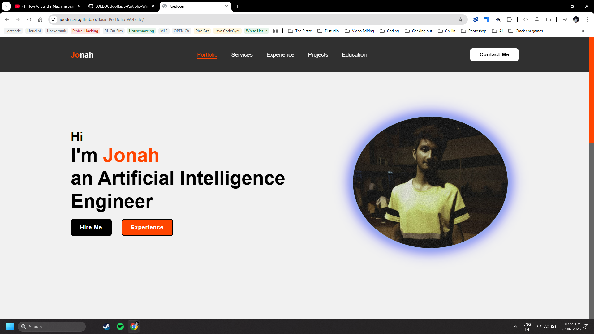

# Joe's Basic Portfolio Website

This is a clean and modern portfolio website built using pure HTML and CSS, designed to showcase personal branding, professional skills, experience, and projects in a concise and visually appealing format.

🌐 Live Site
https://joeducerr.github.io/Basic-Portfolio-Website/

🚀 Getting Started
To view or customize the website locally:
Download or Clone this repo.
Open index.html in any modern browser.
Customize text, images, and styling as needed!
